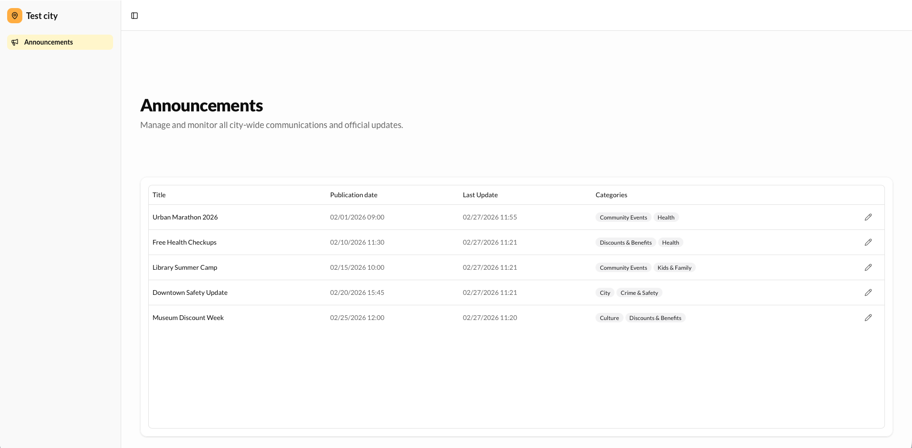
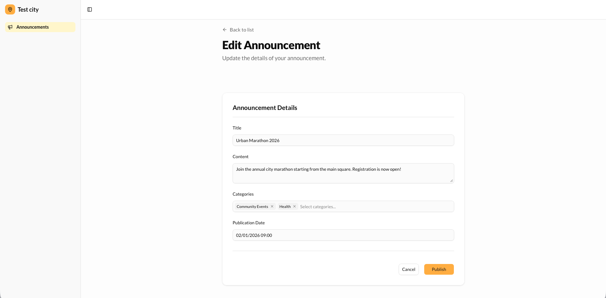

# Announcements Dashboard

Dashboard for managing announcements. Built with Next.js 15, TanStack Query, and TanStack Form.

## Previews

<div align="center">
  
  
</div>

## Quick Start

1. **Install dependencies**:
   ```bash
   pnpm install
   ```
2. **Run dev server**:
   ```bash
   pnpm dev
   ```
   *Make sure the API is running at `http://localhost:8000`.*

## Key Features
- Clean list view with data tables.
- Advanced edit form using TanStack Form.
- Date/time validation (`MM/DD/YYYY HH:mm`).
- Robust error and loading states (Skeletons).
- Fully typed with TypeScript & Zod.

## Tech
- Next.js 15 (App Router)
- TanStack Query
- TanStack Form
- Tailwind CSS 4
- Radix UI primitives
